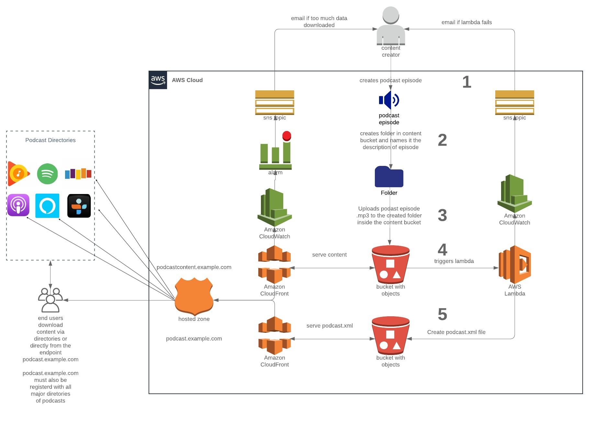

# terraform-podcast
terraform script for provisioning infrastructure to host your own podcast

# Setup

1) You need a domain name
2) $ export TF_VAR_domain_name=example.com
3) $ terraform apply

# Using Infrastructure
1) Record/Edit your podcast episode
2) Create folder in content bucket - name it anything
3) Create a new folder in the content s3 bucket, its name = the episodes description
4) Inside that folder upload the mp3 for the episode, its name = the episodes title

# Run Tests
    cd tests; go test -timeout 45m | tee test_output.log

To definitely do:
1) ensure no public access to bucket (cloudfront to bucket only)
2) certs terraform
3) lambda cloudwatch alarm is not able to publish to the sns topic
4) create cloudfront alarm for bytes downloaded in the content bucket
5) create a new sns topic for that cloudfront alarm
6) generate a subscriber when script is executed
7) create module for everything
8) more logging
9) tests: rss feed test, xml validation, content/rss buckets can't be reached publicly,
subscriber can subscriber to topic, lambda function fail notification, tls is working

improvement ideas: dynamo db store creation/upload times, store mp3 id3 tags, api gateway,
trigger transcription of audio,

Useful links to podcast xml guidelines
[google podcasat rss guidelines](https://developers.google.com/search/docs/guides/podcast-guidelines)
[apple podcast connect](https://help.apple.com/itc/podcasts_connect/#/itcc0e1eaa94)

# Infrastructure provisioned on AWS
 - 1 iam role
 - 3 iam role policy attachments
 - 1 iam role policy document
 - 1 sns topic
 - 1 lambda function
 - 2 s3 buckets (content bucket & rss feed bucket)
 - 2 cloudfront distributions
 - 1 hosted zone
 